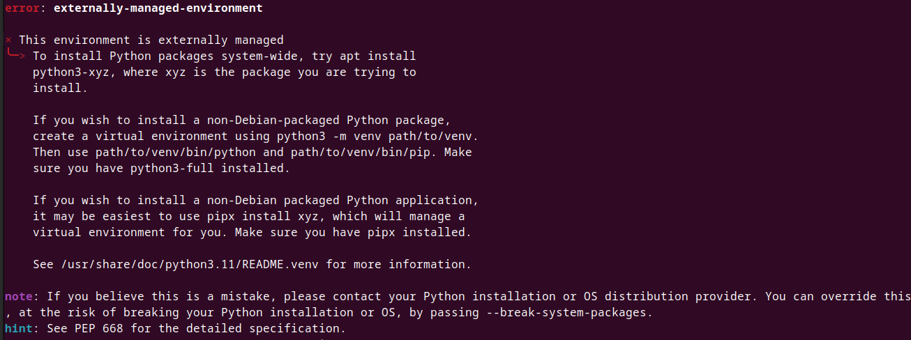

# SCO: SCORM Content Automation

SCO is a comprehensive package designed to automate the development and deployment of SCORM content. It consist of a set of python scritps to manage the imsmanifest.xml file and a javaScript library to simplify SCORM's API managament.

## Table of Contents

- [Installation](#installation)
- [scocli](#scocli)
- [scoapi](#scoapi)
- [First Steps](#firstSteps)
- [License](#license)

## Installation

To install the SCO package, follow the steps below:

```bash
$ pip install scocli 
```
If facing the next problem while installing:



create a virtual enviroment and activate with:

```bash
$ virtualenv myenv
$ source myenv/bin/activate
```
And then try to use pip install again

## scocli
scocli is a package of python scripts to manage the imsmanifest.xml file which defines a SCORM application.

## scocli Scripts

### build
build.py allows you to create a SCORM application as a template, installing algo the javaScript API library. The structure of the template is as follows:

```
./SCORM_application
├── index.html
├── package-lock.json
├── html/
├── images/
├── package.json
├── imsmanifest.xml
├── node_modules/
│   ├── scoapi/
│   │   ├── scoAPI.js
│   │   ├── .babelrc
│   │   └── package.json
│   └── .package-lock.json
├── javascript/
│   └── APIinit.js
└── css/
```

The main elements here are:
* imsmanifest.xml: Is the file which our package will interact with
* node_module: Is where or API library is stored, for it to be used, it must be importated:
```javascript
<script src = "node_modules/scoapi/scoAPI.js"> </script>
```

### addResource

Create a new resource in the SCORM manifest, and also adds a new element to the organization, which refers to the new resource.

#### Usage

Run it from the command line and pass the paths of the files you want to add to the new resource in the `imsmanifest.xml`. For example:

```bash
$ addResource.py <main_file.html> [files]
```
Then, you will be prompted to add an identifier for the new resource and a title. Do not declare two resource with the same identifier.

If you provide an identifier, then the files selected will be added to the already created resource.

### removeResource

Deletes a resource from the manifest, deleting all the organization items that refer to the destroyed resource.

#### Usage

Run it from the command line and specifie the identifier of the resource to be deleted
```bash
$ removeResource.py <item_identifier>
```

### seeManifest

Prints the manifest in a pretiffy format

#### Usage

Run it from the terminal in the imsmanifest.xml directory.

```bash
$ seeManifest.py
```
### organizeManifest

Allows to organize the order in which the contents of the SCORM application are presented.

#### Usage

Run it from the terminal in the imsmanifest.xml directory. Indicate the identifier of the resource you want to reorganize, and the new position.

```bash
$ organize.py <item_identifier> <new_position>
```
### checkManifest

Validates the correct configuration of the imsmanifest.xml file, taking into account all the files in the projects. The next validations are checked:

- The existence of a imsmanifest.xml file in the root of the project.
- The correct structure of the imsmanifest, checking that every opened tag is closes.
- The organization of the manifest, checking that the tags "metadata" "organization" and "resources" exists and have at least one item.
- The declaration of all the project files in the imsmanifest resources section, to ensure that every declare metadata is declared and accesible.

### Usage

Run it from the terminal in the imsmanifest.xml directory

```bash
$ checkManifest.py
```

### bundle

Creates the .zip package to be uploaded in the LMS.

#### Usage

Run it from the terminal in the imsmanifest.xml directory. The name of .zip file created will be the name of the current directory.

```bash
$ bundle.py
```
## scoapi
scoapi is a JavaScript to wrap the functionality of the SCORM's API in a simplified interface for developing.

## Interface:

### initAPI()

Intializes the SCORM API, it is recommended to add this call at the beginning of the SCORM application. It returns the API is succesfull, returns null otherwise.

### Usage
```javascript
initAPI()
```
### finishAPI()
It terminates the interaction with the SCORM API, setting the status of the current activity to "completed". returns 1 if successfull, 0 otherwise.

### Usage
```javascript
finishAPI()
```

